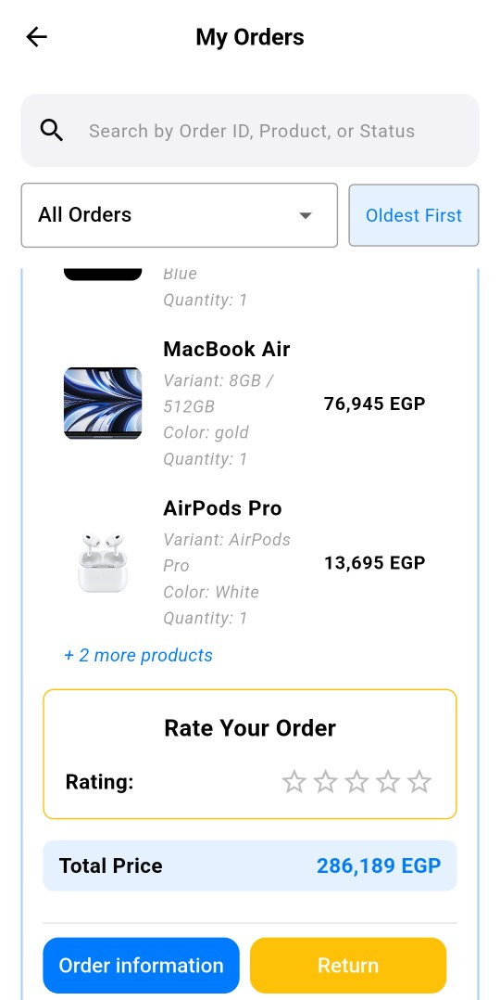
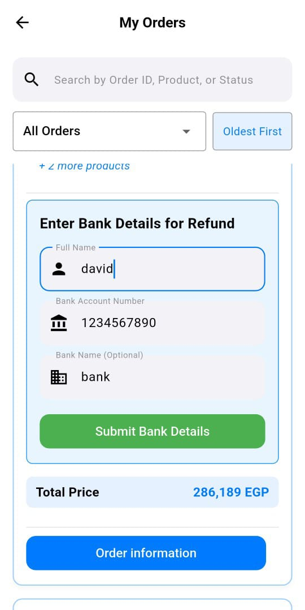

#### 🗂️ Manage Products

  <!-- Add admin manage products screenshots here -->
  &nbsp;&nbsp;
  &nbsp;&nbsp;
  &nbsp;&nbsp;
  

<table>
  <tr><strong>Editable by Admin</strong></tr>
  <tr><td>Product Name</td></tr>
  <tr><td>Variant's Quantity & Price</td></tr>
  <tr><td>Image URL</td></tr>
  <tr><td>Featured / New Arrival status</td></tr>
  <tr><td>Description</td></tr>
  <tr><td>Specifications</td></tr>
  <tr><td>Add/Remove Colors & Variants</td></tr>
  <tr><td>Show/Hide Product (by unchecking both Featured & new Arrival checkboxes)</td></tr>
  <tr><td>Delete from UI or from DB (Supabase)</tr>
</table>

#### ➕ Add Product

  <!-- Add admin add product screenshots here -->
  &nbsp;&nbsp;
  

#### 👥 Manage Users 

  &nbsp;&nbsp;
  

#### 👥 Blocked User when trying to login

  &nbsp;&nbsp;
  

After being blocked by the admin, the user cannot log in. Instead, they see a message with a "Contact Support" button. 
 

#### 📦 Manage Orders
<table>
  <tr>
    <td align="center">
       
      1. User clicks return button
    </td>
    <td align="center">
       
      2. Admin accepts return request
    </td>
    <td align="center">
       
      3. User enters their bank info for refund
    </td>
    <td align="center">
       
      4. Admin can see the user's account info
    </td>
  </tr>
</table>
Orders are categorized as Being Processed, Shipped, Delivered, Returned, and Cancelled, making it easier to manage and locate them. A search bar is also available for finding specific orders. If a user returns a product, the return must be approved by the admin before a refund can be issued and then the user is allowed to enter their bank details for the refund.

#### 📊 Sales Analytics

  &nbsp;&nbsp;
 &nbsp;&nbsp;
  &nbsp;&nbsp;
    &nbsp;&nbsp;
 &nbsp;&nbsp;
  &nbsp;&nbsp;
    &nbsp;&nbsp;
 

Includes charts and summaries of orders and sales data, including category-wise and subcategory-wise sales, product sales, recent orders and the number of delivered and cancelled orders, helping in taking the right decision.
