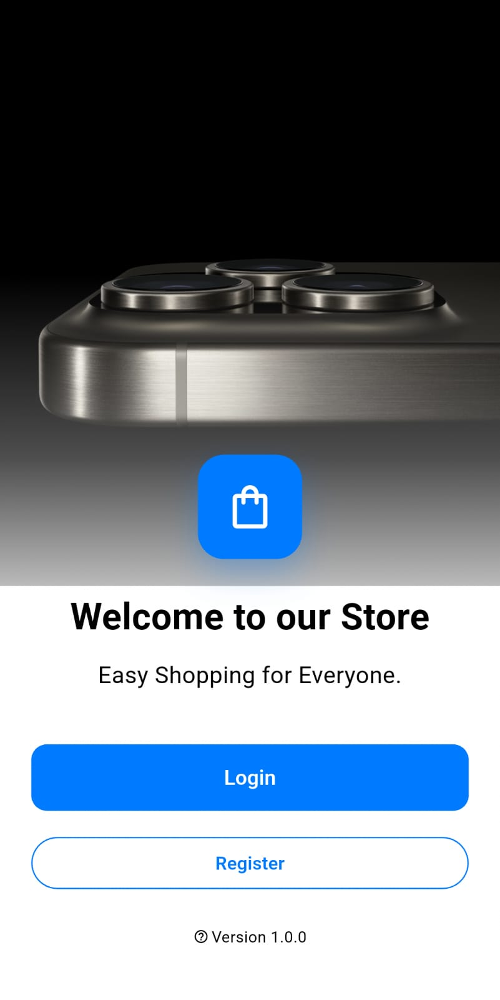
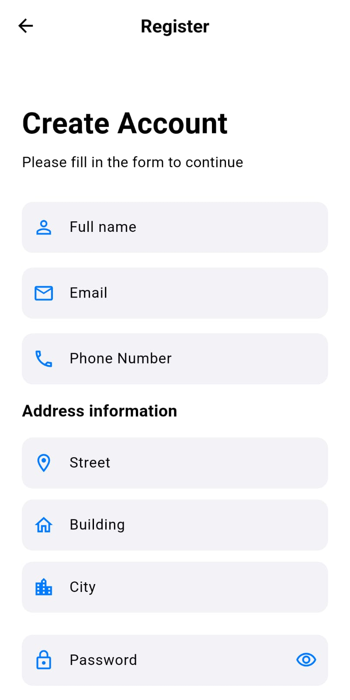
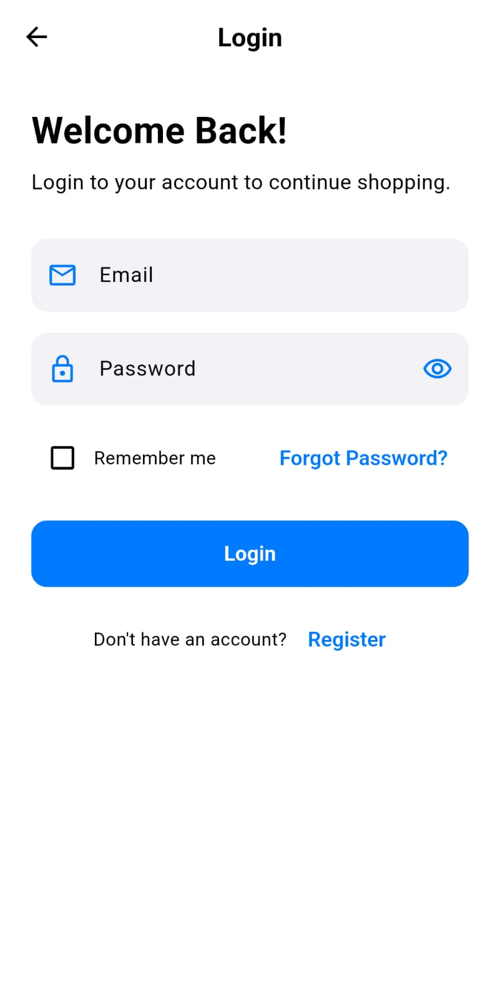
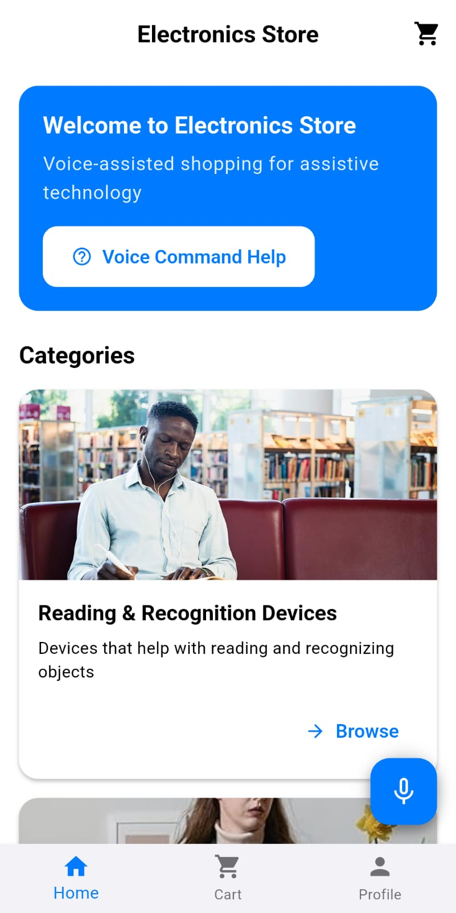
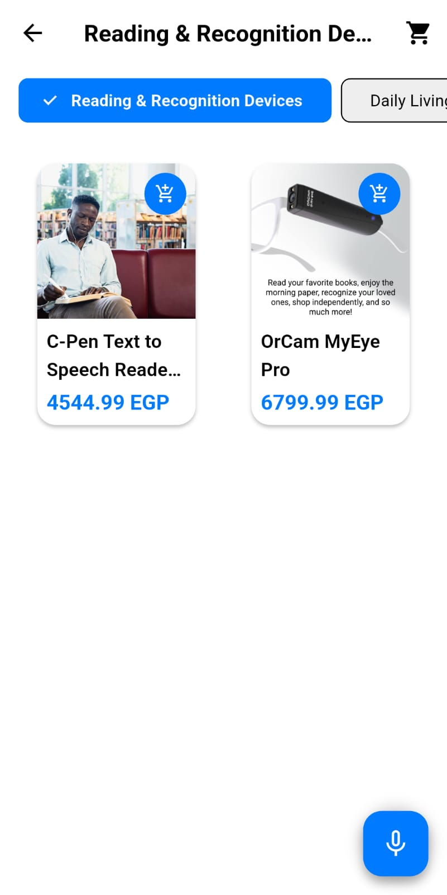
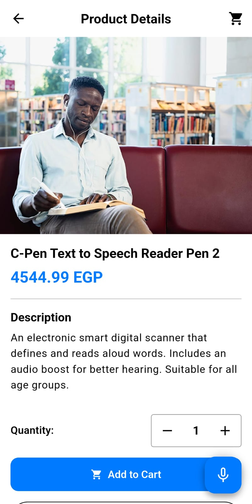
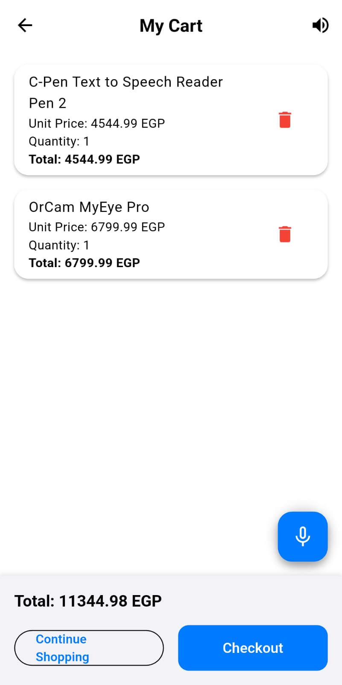
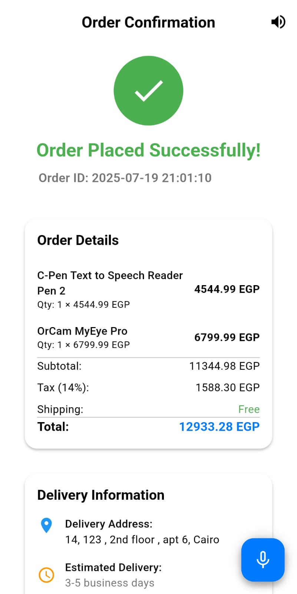
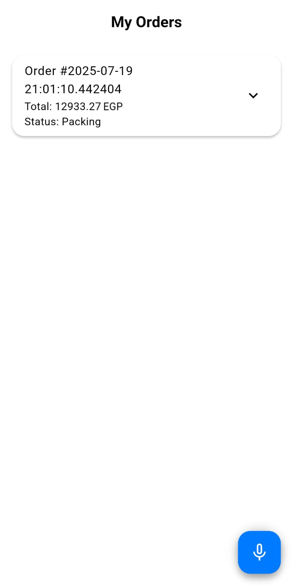
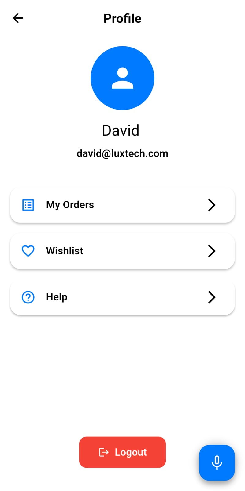

#### Welcome Screen

  

#### Registration & Login

  &nbsp;&nbsp;
  

These screens allow users to register and log in easily.

#### Home Screen

  

In this screen, voice feedback announces the available categories. Users can select a desired category at any time by pressing the mic button and saying 'open category' followed by the category name or number. Categories can also be read again at any time by saying 'home'.

#### Category Screen

  

After users select a category using voice commands, the products are read aloud to them. They can choose a product by saying 'Open product' followed by its number to hear detailed product information.

#### Product Screen

  

Once the user selects a product from the previously selected category using voice commands, its details are read aloud.

#### Cart Screen

  

Users can complete the checkout process or view their cart simply by saying “checkout” or “confirm order”.

#### Checkout Screen

  

In this screen, Order Summary, Delivery address are read to the user.

#### Order Confirmation Screen

  

In this screen, Order details are read to the user.

#### My Orders Screen

  

In this screen, order details are displayed, including the order number, time, quantity, total price, and current order status.

#### Profile Screen

  

Here users can visit the Help screen, view their Wishlist, or access My Orders screen using voice commands.

