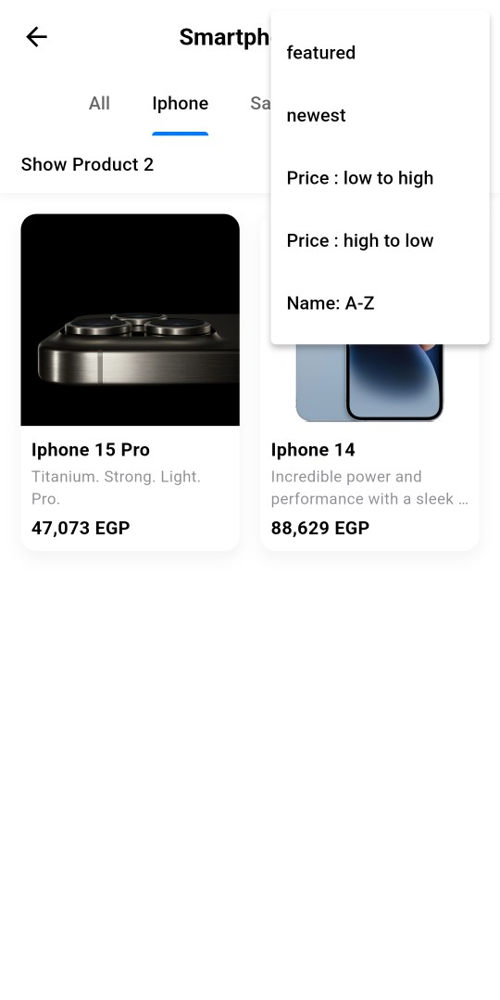

#### 👋 Welcome Screen

  &nbsp;&nbsp;
  &nbsp;&nbsp;
  

Here, users can log in or register, access the Help and About screens by clicking the version number at the bottom.

#### 🔐 Registration & Login

  &nbsp;&nbsp;
  &nbsp;&nbsp;
  &nbsp;&nbsp;
  &nbsp;&nbsp;
  

Registration screen allows users to enter their details such as name, email, password, phone number, street, building, and city. If Users can tries to log in before confirming their email, a pop-up message appears saying “please check your email for confirmation”.

#### 🏠 Homescreen

  &nbsp;&nbsp;
  &nbsp;&nbsp;
 

**📂 Categories**
 

 &nbsp;&nbsp;
&nbsp;&nbsp;

- Users can search for products.
- view the latest product arrivals and featured products, browse by different categories.
- toggle the dark theme.
- Navigate between different screens at the bottom such as cart, Wishlist, and my account.
- Browse products by category and subcategory for easier navigation. Filters like newest first, price high to low, and price low to high are also available.

#### 📱 Product screen

  &nbsp;&nbsp;
  &nbsp;&nbsp;
 

- User can add the product to the Wishlist or cart
- copy product link
- select a variant from the available options, choose product color, 
- view similar products, and see the product’s specifications and description.

#### 🛒 Cart

  

**🛒 On the cart screen,** 
products are grouped by category and subcategory. 
For example, if there are two different phones under the "Phone" category with "Apple" and "Samsung" as subcategories, each product appears under its respective subcategory, making the cart organized and easy to understand. Users can adjust the quantity of each product, and the order summary displays the subtotal, shipping, taxes, and the total amount to be paid.

#### 💳 Payment

  &nbsp;&nbsp;
  &nbsp;&nbsp;
  &nbsp;&nbsp;
  &nbsp;&nbsp;
  &nbsp;&nbsp;
  

**💳 The payment screen includes 3 steps,**
1. Users cans can edit their delivery information if needed, including address, building, and street. 

2. Users can selects a payment method, which can be one of the following: COD, Bank Transfer or Credit Card.

3. Users can reviews the order, which includes all selected products, each product’s selected variant, color, quantity, subtotal, picture, and pricing details.

#### ✅ Order Confirmation

  &nbsp;&nbsp;
  

**✅ The Order Summary** includes the shipping address, phone number, and payment method, followed by a list of ordered products with their details (name, variant, color, quantity, and price). It also shows the subtotal, shipping cost, taxes, and a calculated final total amount.

#### 👤 My Account

  

**👤 The My Account screen includes the following features:** 
1. Edit Account Info: Allows Users can to update their username, phone number, and delivery address.

2. My Orders & Wishlist: Quick access to Users can’s order history and saved items.

3. Colorblind Mode: Offers three different types of color customization to adjust buttons and the overall UI for different types of color vision deficiencies.

4. Help Center & About Our App: Provides information about the app and includes contact and support details.

#### 👤 Edit account info

  &nbsp;&nbsp;
  

#### 📦 My Orders

  &nbsp;&nbsp;
  &nbsp;&nbsp;
  

**📦 In My Orders screen,**
- Users can can search for an order by order ID, product name, or order status. 

- They can also filter orders according to order status and sort them either from newest to oldest or vice versa. 

- Each order displays key details by default, and more detailed information can be viewed by pressing the "Order Information" button.

- Order statuses such as Being Processed, Shipped, and Delivered are shown with a visual indicator on the right for easy tracking.

- Additionally, a Return option is available for users to initiate a return if needed.

#### 🔁 Return Order

  &nbsp;&nbsp;
  

Admin approval is required before Users can can enter bank details to receive a refund.

#### 🎨 Color Blind Themes

  &nbsp;&nbsp;
  &nbsp;&nbsp;
  &nbsp;&nbsp;
  &nbsp;&nbsp;
  &nbsp;&nbsp;
  

Three color blindness themes are available for users with red, green, or blue color vision deficiency. Selecting a theme updates the entire app’s color scheme to match their visual needs.

#### 🌙 Dark Mode

  &nbsp;&nbsp;
  &nbsp;&nbsp;
  &nbsp;&nbsp;
  &nbsp;&nbsp;
  &nbsp;&nbsp;
  

